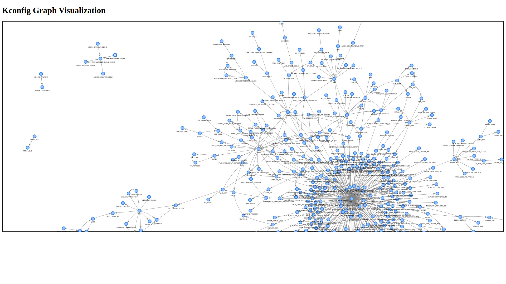

# kconfig-dependency-viewer

A tool to display Kconfig dependency trees on a webpage for a given
kernel configuration.

## Usage
```
kconfig -d <kernel_dir> -c <conf_file>
```
-   `<kernel_dir>`: Path to the Linux kernel source directory.
-   `<conf_file>`: Path to the Kconfig configuration file.

## Features

-   Visualize Kconfig dependencies in an easy-to-navigate web interface.
-   Automatically parses and displays options based on the provided 
    configuration file.



## Why Use This?

-   **Debugging Configuration Issues**: Easily identify dependency 
    conflicts or missing options.
-   **Simplified Configuration Review**: Visualize complex dependency 
    trees without manually parsing configuration files.
